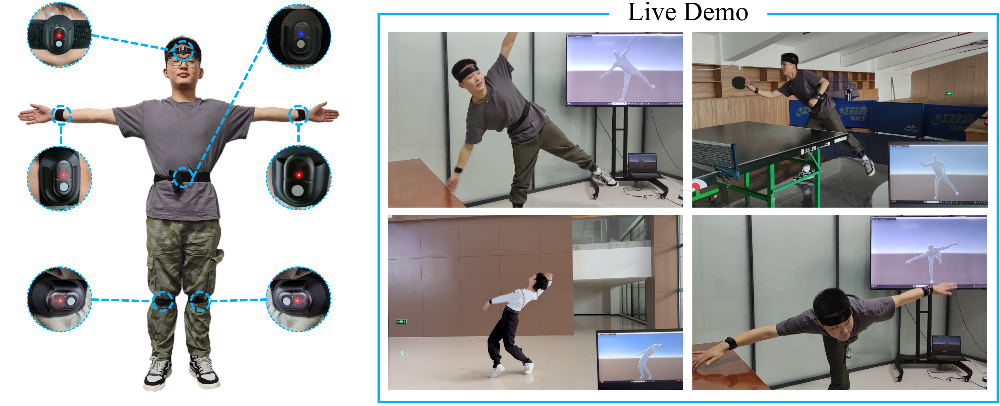

# ASIP
Code for our paper ASIP: **Accurate and Steady Inertial Pose Estimation through Sequence Structure Learning and Modulation**. 

## Overview

Left: we use only six IMUs to predict the full-body pose in real-time, which are fixed on left and right forearm, the left and right lower leg, the head, and the pelvis. Right: our system is capable of capturing a wide range of daily motions as well as challenging movements.

You can view more real-time motion capture results here. 
## Environment Setup

### Install dependencies
We use ```python 3.7.6```. You should install the newest ```pytorch chumpy vctoolkit open3d```.

### Prepare SMPL body model
1. Download SMPL model from [here](https://smpl.is.tue.mpg.de/). 
2. You should click SMPL for Python and download the version 1.0.0 for Python 2.7 (10 shape PCs). Then unzip it.

### Prepare pre-trained model
1. You can download our pre-trained model from [here](https://pan.baidu.com/s/1BxD0FC19Lxy_bf3aOeNaLw?pwd=lhu7).
2. Unzip it and put the `ck.bin` file into `./checkpoint`.

## Preprocessing Data
- Following [Transpose](https://github.com/Xinyu-Yi/TransPose), we preprocess the AMASS, DIP and TotalCapture datasets.
- Following [DynaIP](https://github.com/dx118/dynaip), we preprocess the AnDy and CIP datasets.
- The raw data of these datasets can be downloaded from [AMASS](https://amass.is.tue.mpg.de/), [DIP](https://dip.is.tue.mpg.de/), [TotalCapture](https://cvssp.org/data/totalcapture/), [AnDy](https://zenodo.org/records/3254403) and [CIP](https://zenodo.org/records/5801928).

We have provided preprocessed test data, which you can download [here](https://pan.baidu.com/s/1BxD0FC19Lxy_bf3aOeNaLw?pwd=lhu7).  Unzip it and put them into `./dataset/eval_set`. Please note that by downloading the preprocessed datasets you agree to the same license conditions as for the papers, e.g., DIP-IMU dataset (https://dip.is.tue.mpg.de/) and the TotalCapture dataset (https://cvssp.org/data/totalcapture/). You may only use the data for scientific purposes and cite the corresponding papers.

## Running the Evaluation
```python common/eval_all.py```
  
## Acknowledgment
We thank that these two repositories [Transpose](https://github.com/Xinyu-Yi/TransPose) and [DynaIP](https://github.com/dx118/dynaip) have provided many useful code. 
## Citation

If you find the project helpful, please consider citing us:
```bibtext
@article{wu2024accurate,
  title={Accurate and steady inertial pose estimation through sequence structure learning and modulation},
  author={Wu, Yinghao and Wang, Chaoran and Yin, Lu and Guo, Shihui and Qin, Yipeng},
  journal={Advances in Neural Information Processing Systems},
  volume={37},
  pages={42468--42493},
  year={2024}
}
```
